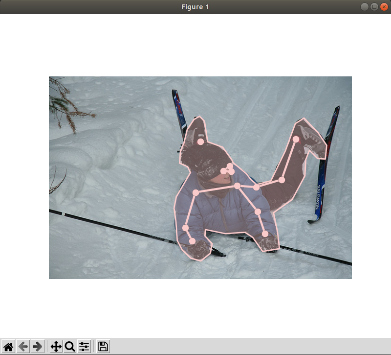
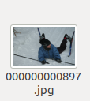

# COCO2017 Dataset Human Pose Visualized

## Result Example

<div align="center">
    <br>
    Example
</div>

## Quick start
1. Install [COCOAPI](https://github.com/cocodataset/cocoapi):
   ```
   pip install pycocotools
   ```
2. Install dependencies:

   ```
   pip install matplotlib
   pip install scikit-image
   pip install pylab
   ```

3. Download MSCOCO2017 dataset and annotation files, your dir tree should like this
   ```
   ${ROOT}
    |-- annotations
    |   |-- person_keypoints_train2017.json
    |   `-- person_keypoints_val2017.json
    |--train2017
    `--val2017
   ```

4. Modify image id in coco_visualized.py line 12
   
   The id is three digits which correspond to the three digits at the end of the image file name.

   For example, you want to see this:
   <div align="center">
    <br>
    Example
   </div>

   You could modify: 
   ```
   imgIds = coco.getImgIds(imgIds=[897])
   ```

5. Run the coco_visualized.py

### Contact
```
ligaoqi02@gmail.com
```
